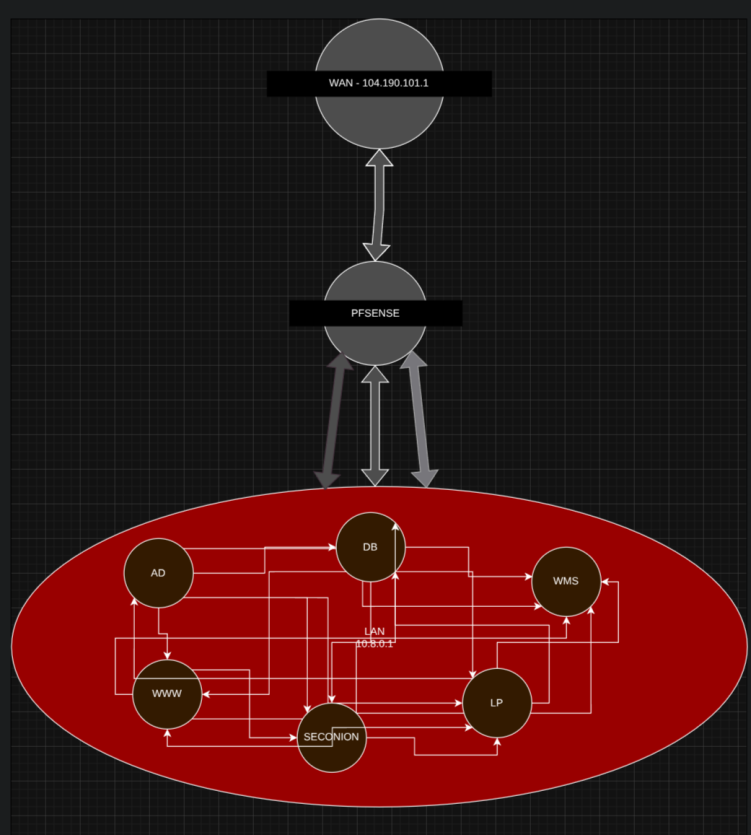

# Network Change Report

2026 21st of April – CDT 11:41 AM

> [!NOTE]
>
> `10.8.0.0/24` is the LAN.
> `199.100.16.100`/`199.100.16.101` is the Proxy IP and the Blue VPN IP.

<div style="page-break-after: always;"></div>

[TOC]

<div style="page-break-after: always;"></div>

## Network Layout

Rationale: pfSense acts as the perimeter firewall between the ISEAGE competition network & all internal servers. All scenario servers reside on the LAN segment behind pfSense (`10.8.0.0/24`). Security Onion provides IDS/IPS monitoring on the LAN segment to detect & alert on malicious activity while isolating internal traffic from direct external exposure.



### Existing Servers

| Host-name Prefix | IP (Local)  | IP (Public/WAN)  | OS                  |
| ---------------- | ----------- | ---------------- | ------------------- |
| `AD`             | `10.8.0.10` | `104.190.101.10` | Windows Server      |
| `WWW`            | `10.8.0.20` | `104.190.101.20` | Alma Linux 8        |
| `DB`             | `10.8.0.40` | `104.190.101.30` | Ubuntu 16.04        |
| `WMS`            | `10.8.0.30` | `104.190.101.40` | Ubuntu 24.04        |
| `LP`             | `10.8.0.50` | `104.190.101.50` | Windows Server 2019 |

<div style="page-break-after: always;"></div>

## Shared Hardening (Linux Servers)

Hardening & securing steps shared across all Linux systems

Systems covered under this section:

- WWW (World Wide Web)

- DB (Database)

- WMS (Warehouse Management Server)

### User Management

| Target | Action | Rationale |
|----|----|----|
| root | Locked & Removed password | Secured a standard system account to prevent accidental or malicious use. |
| nobody | Locked | Secured a standard system account to prevent accidental or malicious use. |
| scrat | Deleted | Removed an unauthorized or unnecessary user account. |
| sid.john.leguizamo | Deleted | Removed an unauthorized or unnecessary user account. A PAM back-door granted this user perfect `root` permissions even if the shadow file had shown a non-zero UID. |

* ...& across all machines, *including Windows Servers,* we have of course, also changed the default credentials for the `cdc` user (Linux) & `Administrator` users (Windows) to complex strings that also remain type-able with moderate effort.

### Software Net Positives

> [!NOTE]
>
> Only this specific section applies to ALL machines, meaning including the Windows machines.

| Target | Action | Rationale |
|----|----|----|
| All software | Updates | Up-to-date software ensures the latest patches whether that be quality-of-life features, security features, or security patches to counter CVEs. |
| Bloat-ware (CUPS, Cortana, etc.) | Removed | While not necessarily harmful, poses a small amount of risk & as they’re not needed, have been removed to decrease attack surface. |

### Software Configuration

#### Logging (AuditD)

Installed the `AuditD` package on every Linux machine & inserted the AuditD rules below @ File `/etc/audit/auditd.rules`:

```bash
## Monitor all executions
-a always,exit -F arch=b64 -S execve -k execution_monitor
-a always,exit -F arch=b32 -S execve -k execution_monitor

## Monitor file modifications
-a always,exit -F arch=b64 -S write,rename,chmod,chown -k file_mods
-a always,exit -F arch=b32 -S write,rename,chmod,chown -k file_mods

## Lock the configuration
-e 2
```

Logs are to be forwarded remotely to the SecOnion server.

#### PAM (Pluggable Authentication Module)

| Configuration | Action | Rationale |
| --- | --- | --- |
| `nullok`/`nullok_secure` | Removed | The recovery of a locked account is a **much** better issue than risking a compromise because of a configuration value that says “*Empty password? C’mon in!*”. |
| `faillock` | Enabled | Standard procedure to lock out accounts after some amount of failures. |
| `pwhistory` | Enabled | Standard procedure to ensure passwords are not recycled. |

#### SSH (Secure Shell)

| Configuration | Old Value | New Value | Rationale |
| --- | --- | --- | --- |
| PermitRootLogin | yes | no | Accountability should be clear & actions should be able to be traced back to the responsible person, & therefore direct root login has been disabled. |
| PubkeyAuthentication | yes | no | Remains un-utilized by the CDC corporation (even though it would be better for security) & so to avoid possible planted hidden keys, has been disabled. |
| GSSAPIAuthentication | yes | no | Disables unused SSO technology to minimize potential vulnerabilities. |
| IgnoreRhosts | no | yes | Prevents potential backdoors via user-controlled rHosts files. |
| IgnoreUserKnownHosts | no | yes | Limits the lateral movement risk if a user account is compromised. |
| X11Forwarding | yes | no | Disables unused graphical forwarding to reduce the attack surface. |
| Match User cdc | N/A | `AllowUsers cdc@199.100.16.101` | The `cdc` user is to neve be accessed by anyone other than Blue Team, us. As a result, SSH access to it has been restricted to the Blue VPN. |
| Subsystem | `SFTP` | None | The `SFTP` subsystem of SSH is not to be utilized as it is not required & poses risk that would otherwise be less likely in the given restricted user-land curated by blue team. |

#### Fail2Ban

Installed & configured for an 8 hour ban on 5 failed authentication attempts in 10 minutes.

- Excluded localhost @ `127.0.0.1/8`

- Excluded the LAN at @ `10.8.0.0/24`

- Excluded the Blue VPN IP @ `190.100.16.101`


Services being monitored:

- SSH/SSHD

- MySQL

#### Firewall : `FirewallD`

> [!NOTE]
>
> All instances of UFW found were replaced by `FirewallD` in favor of its granulinity.

| Direction | Port | Type | Allowed | Rationale |
| --- | --- | -------------- | --- | --------------------------------------------------------------------------- |
| In  | ALL | ALL            | No  | Default Deny: Blocks all traffic not explicitly permitted.                  |
| In  | 80  | TCP            | Yes | Required for public access to the storefront & the backend.                 |
| In  | 22  | TCP            | Yes | Required for administrative SSH access.                                     |
| In  | ALL | ICMP Timestamp | No  | Prevents reconnaissance attempts that use clock data to identify OS/uptime. |
| In  | ALL | ICMP Echo      | No  | Disables ping responses to obscure the server’s presence from scanners.     |

#### System-specific services

Services covered under this section:

- WWW/Front-end

- DB/MySQL Database

- WMS/Back-end

Installed custom SystemD hardening override files to the service’s respective overrides folder

The referenced directory can be found at `/etc/systemd/system/(SERVICE NAME).service.d/`, & in that referenced directory, the referenced custom override file is named `override.conf` - The referenced `override.conf` file contains restrictions to reduce the blast radius of compromised services

Examples of this are found below:

  - `ProtectSystem` (ensures core parts of the system are mounted as read-only for the service)

  - `ProtectHome` (ensures user home directories are not to be read or tampered with) - `NoNewPrivieges` (ensures the service may not re-escalate to previously blocked permissions)

  - Too many to list here. Reference the example override for a generic front-end service below.

```shell
[Service]
# De-escalate service.
User=www-data
Group=www-data

# Resource limits | Adjust as needed for your scale.
RestrictRealtime=true
TasksMax=64
MemoryMax=2G
MemoryHigh=1800M

# Filesystem protections | Adjust as needed for your setup.
UMask=077
RuntimeDirectoryMode=755
WorkingDirectory=
ProtectSystem=strict
ProtectHome=tmpfs
ReadWritePaths=
BindReadWritePaths=
ReadOnlyPaths=
BindReadOnlyPaths=
NoExecPaths=/tmp /var/tmp /dev/shm

# Capability limitations | Adjust as needed for your setup.
SystemCallArchitectures=native
SystemCallFilter=@basic-io @file-system @system-service @network-io @process @signal @memlock
RestrictAddressFamilies=AF_INET AF_INET6 AF_UNIX
CapabilityBoundingSet=CAP_NET_BIND_SERVICE
AmbientCapabilities=CAP_NET_BIND_SERVICE

# System & recon protection | Likely won't need to change
ProtectProc=invisible
NoNewPrivileges=true
LockPersonality=true
RestrictNamespaces=true
RestrictSUIDSGID=true
ProtectControlGroups=true
ProtectKernelTunables=true
ProtectKernelModules=true
ProtectKernelLogs=true
ProtectClock=true
ProtectHostname=true
PrivateTmp=true
PrivateDevices=true
DevicePolicy=closed

# May break some applications
PrivateUsers=true

# If using a local database via IPC, change to false.
RemoveIPC=true
```

Aside from applying strict kernel-level restrictions, we also deescalated all primary services from the `root` user down to a more reasonably permission-ed user such as the commonly used `www-data` user or the `MySQL` user.

#### `/etc/sudoers` Configuration

| Previous effect | Current effect | Rationale |
| --- | --- | --- |
| Allowed all `domain users` to use `sudo` on all commands | Strictly only allows `it administrators` & the `wheel` group to use `sudo` on all commands. | Non-administrators should not be able to conduct changes on a system befitting of administrators. |

### Software/File removals

| File/program | Extent | Rationale |
| --- | --- | --- |
| `/root/.john-leguizamo` | Complete purge | Contains unsafe red team source code for backdoor planting. Was thoroughly audited & reverse-engineered to find lingering back-doors |
| `/lib/x86_64-linux-gnu/libnss_backdoor.so.2` | Complete purge | A PAM standalone C binary meant for use in PAM to intercept credentials. This backdoor likely is a result of the source code found above. |
| `/usr/bin/john` | Complete purge | The file was a program that had the `SUID` bit, meaning the owner of the file (`root`) was the user that the file would run as. The file ran arbitrary scripts that would compromise the security of the system. |
| `C`/`C++` Compilers | Complete purge | `C`/`C++` binaries do not need to be compiled aboard the servers. Compilers allow for foreign binaries to be made on-system. |
| `/etc/crontab` | Singular line removal | The line removed was a `crontab` job that ran as root & occasionally but frequently reset the password of the root user to `cdc`. |
| GUI/Desktop Environment Packages | Complete purge | As convenient as it is for sysadmins unfamiliar with the terminal, all users managing the Linux systems on our team are familiar somewhat with the terminal & therefore the GUI & any dependencies pose necessary attack surface, such as `polkit`. |
| `Vi`/`Vim`/`Ed` | Complete purge | While the default text editor for many systems, is rather unbounded in its capabilities such as launching new shells & is therefore unsafe for our purposes. |
| Git-related binaries | Complete purge | Remains unutilized & is removed to reduce attack surface. |
| `UFW` | Complete purge | `FirewallD` remains the favored firewall for this blue team. |
| `PAM` | Reinstall | Parts of `PAM` failed system package manager integrity checks & so it was re-installed to remove possible back-doors. |

### File-system Ownership & Permission Repairs

> [!WARNING]
>
> The permissions on the home directories were especially the most offensive, being `755` instead of `700`, meaning anyone could read & execute any files inside another person’s home directory.
>
> We also don’t get why the default permissions for the `/etc/systemd/system` directory is 755 even though no unprivileged user needs to read from the services nor their override files. We have rectified that to `600` for files in the directory & `700` for directories in the directory.

Applied fixes to the systems’ file/directory permission & ownership as per the script below.

```bash
# Add Sticky Bit to world-writable directories
find / -xdev -type d -perm -0002 ! -perm -1000 -exec chmod +t {} +
#
# For files with an invalid owning user or group, change the owning user & group to root
find / -xdev \( -nouser -o -nogroup \) -exec chmod 640 {} + -exec chown root:root {} +
#
# Remove broken symlinks
find / -xdev -xtype l -exec rm -v {} +
#
# Ensure sticky-bit on world-writable dirs
chmod +t /tmp /var/tmp /dev/shm
#
# Fix permissions for files regarding identity management
chown root:root /etc/passwd /etc/group /etc/sudoers
if
	grep -q '^shadow:' /etc/group
then
	chown root:shadow /etc/shadow /etc/gshadow
	chmod 640 /etc/shadow /etc/gshadow
else
	chown root:root /etc/shadow /etc/gshadow
	chmod 600 /etc/shadow /etc/gshadow
fi
chmod 644 /etc/passwd /etc/group
#
# Ensure only root can read the bootloader config
find /boot -type f -exec chown root:root {} + -exec chmod 640 {} +
find /boot -type d -exec chown root:root {} + -exec chmod 750 {} +
#
# Ensure SystemD unit files are secure
find /etc/systemd/system -type f -exec chown root:root {} + -exec chmod 640 {} +
find /etc/systemd/system -type d -exec chown root:root {} + -exec chmod 750 {} +
#
# Secure cron tabs & directories
chown root:root /etc/cron* /etc/at.allow
chmod -R 750 /etc/cron.* /etc/at.allow
chmod -R 640 /etc/crontab
#
# Secure sudoers configuration
chown -R root:root /etc/sudoers /etc/sudoers.d
chmod -R 640 /etc/sudoers
chmod -R 750 /etc/sudoers.d
chmod -R 640 /etc/sudoers.d
#
# Restrict dmesg access
chown -R root:root /bin/dmesg /usr/bin/dmesg
chmod -R 700 /bin/dmesg /usr/bin/dmesg
#
# Secure SSH configurations
find /etc/ssh -type f -exec chown root:root {} + -exec chmod 600 {} +
find /etc/ssh -type d -exec chown root:root {} + -exec chmod 700 {} +
chmod -R 644 /etc/ssh/*.pub
#
# Secure MOTD/banners are secured
chown -R root:root /etc/issue /etc/issue.net /etc/motd
chmod -R 644 /etc/issue /etc/issue.net /etc/motd
#
# Ensure log files are secured
chown -R root:root /var/log
chmod -R 750 /var/log
#
# Secure rsyslog or syslog-ng configs
chown -R root:root /etc/rsyslog.conf /etc/rsyslog.d/*
chmod -R 640 /etc/rsyslog.conf /etc/rsyslog.d/*
#
# Secure Auditd logs & configs
find /etc/audit -type f -exec chown root:root {} + -exec chmod 640 {} +
find /etc/audit -type d -exec chown root:root {} + -exec chmod 750 {} +
#
# Secure global shell profiles
chown -R root:root /etc/profile /etc/bashrc /etc/bash.bashrc /etc/profile.d/*
chmod -R 644 /etc/profile /etc/bashrc /etc/bash.bashrc /etc/profile.d/*
#
# Secure existing home directories
chown -R root:root /root
chmod -R 700 /home/* /root
```

### Extra preventative & noise-making measures

We installed 4 primary custom scripts:

- A script to log all user terminals with the exception of the `cdc` user.

- A script to make the logs from the above immutable once the log is closed & finished.

- A script to lock files in a specific state of permissions & ownership.

- A custom file @ `/etc/profile.d/secure-env.sh` that severely restricts the user-land area/the shell

	- Examples consist but are not limited to the below:

	- Users may not change variables starting with `SSH_`\*

	- Users may not change the `USER` or `LOGNAME` variable

	- Users may not reconfigure their shell options (`shellopts`) using `shopt` or `enable`.

	- Users may not use the built-in echo command & must call the external binary

- A custom file @ /opt/mini-bull.sh that

A side-effect of the logging is that non-interactive SSH sessions will not work.

<div style="page-break-after: always;"></div>

## WWW (Public Website)

### Software Configuration

#### Front-end Service

| Target                                    | Action                                                       | Rationale                                                    |
| ----------------------------------------- | ------------------------------------------------------------ | ------------------------------------------------------------ |
| `auth.py` dependency/utility in code-base | Removed the ability to elevate to an administrator on the front-end by gaining 200 "*loyalty points*". | Administrators on the front-end can modify stock information including the creation/deletion of items and price changes, which is usually not something up to the discretion of a loyal shopper. |
| `auth.py` dependency/utility in code-base | Changed the default for a user elevation function from `Admin=true` to `Admin=false`. | In the event the function is used incorrectly, assuming that elevating a user to administrative permissions is quite the bold (and insecure) assumption for the program to make. |
| Code-base Location & Ownership            | Moved from `/home/cdc/` to `/home/www-data`—changed ownership from `cdc:cdc` to `www-data:www-data`. | Privilege separation is a good idea; a web server shouldn't run as root and it also shouldn't run as a user that can possibly access root. |
| Secrets                                   | Moved sensitive secrets from the service's configuration file (`config.py`) to a file owned by `root:root` with permissions `600`. | The service needs only to read its configuration, and read it only once—and that's at the initialization of the service. Any further access would absolutely be a security risk for a service that parses user input in anyway including user sign-up and login. |
| Flask                                     | Changed to `Gunicorn`                                        | Flask is not made for enterprise web servers and is single-core, meaning it only utilizes a fraction of the CPU that it could which can act as a performance bottleneck. |

### Software/File Removals

| File/program | Extent | Rationale |
|----|----|----|
| `/home/cdc/.bashrc` | Removed the below lines | Disables SELinux & made the `/etc/shadow` file world-writable & world-readable. Clearly undesirable behavior, & may trick users who log on for the first time.<br />Kind of a dirty trick to play. |

```bash
sudo chmod -R 777 /etc/shadow
sudo setenforce 0
```

## WMS (Warehouse Management)

To comply with the requirement that “...Warehouse Workers must have access to update stock information” swiftly (as the scenario document was most unhelpful in determining in what method to do so), we have decided to allow Warehouse Workers into SSH for WMS with the restriction that they are immediately dropped unto SQL with only the permissions inferred to meet the requirement.

<div style="page-break-after: always;"></div>

## DB (Database)

### Software Configuration

#### MySQL

| Action | Result | Rationale |
| --- | --- | --- |
| Run `mysql_secure_installation` script | Completed | Applies baseline security hardening to the database engine. |
| Restrict `richard` SQL user to LAN `.30` & `.20` | Done | Reduces possible openings. |
| Anonymous Users | Removed | Ensures only authenticated users can access database resources. |

<div style="page-break-after: always;"></div>

## AD (Active Directory)

### User Management

| Action | Result | Rationale |
| --- | --- | --- |
| Disabled user accounts troy tomson, guest, scrat | Disabled | Accounts that are unknown or insecure are to be deleted or disabled. |
| Protected all scenario groups from accidental deletion | Enabled | Prevents red team from potentially reducing availability, is also good practice to prevent accidental deletion |
| Removed user John Leguizamo from IT Administrators | Removed | John Leguizamo is not a documented user nor administrator. |

### Software Configuration

#### Security Settings

| Target | Action | Rationale |
| --- | --- | --- |
| Passwords stored with reversible encryption | Disabled | No reason to have this enabled, only makes it easier for red team to get any potential user passwords. |

#### User Permissions

| Action | Result | Rationale |
| --- | --- | --- |
| “Everyone” permissions to anonymous users | Disabled | Reduced attack surface for anonymous users. |
| Disallowed group Domain Users from `RDP` access | Permissions Removed | Standard domain users do not need access to the `RDP` service, this reduces manuverability for a potential red team breach. |
| Removed `RDP` access from users Guest, scrat, & troy tomsonson | Removed | Removing unknown/insecure users reduces potential nonpermitted logon oppurtunity. |
| Added group IT Administrators to Domain Administrators | Added | Allows for the IT Administrators group to perform administrative tasks. |
| Removed group Domain Users from group Domain Administrators | Removed | This rule would allow for all users on the domain to have administrative permissions, allowing for red team to perform any action with the breach of one account. |
| Gave RDP access to IT Administrator group | Added | Required as per the scenario. |

#### Firewall

| Action | Result | Rationale |
| --- | --- | --- |
| Disabled firewall rule for Cortana Service | Disabled | Reduces attack surface by disabling unneeded rules. |
| Users cannot add/login with Microsoft accounts | Disabled | Microsoft accounts are not used in this scenario, reduced attack surface |
| Auto administrator login for recovery console | Disabled | If red team got the machine into recovery mode, they would have access to any administrator command line permissions. |
| Floppy copy access to all files & folders for recovery console | Disabled | similar rationale as to previous, but with a smaller attack surface |
| Windows remote management firewall rules | Disabled | Remote management is not the same as Remote Desktop, & is not required for the scenario. |
| Cast to devices firewall rules | Disabled | This machine does not need to cast to other devices, the rules being on only creates security risk. |

### Software/File removals

| Target | Action | Rationale |
| --- | --- | --- |
| Plug 'n Play, print spooler, themes, CPDUserSvc_2d96e | Removed | Reduces attack surface by disabling unused services. |
| Downloading manufacturers custom icons | Disabled | Non-essential service, disabled for a reduced attack surface. |
| Deleted malicious script found in Downloads | Removed | Script contained user credentials for the Administrator user, allowing automatic logon. |

### User & Group Security

| Action | Target(s) | Rationale |
| --- | --- | --- |
| Disabled Account | guest, scrat, troy tomson | Disables accounts that are unused or suspicious. |
| Removed from Domain Administrators | Domain Users | Enforces the principle of least privilege for standard users. |
| Access Restricted | `RDP` | Restricted `RDP` access exclusively to the IT Administrators group. |

### System & Service Configuration

#### Security Policies

| Policy | Setting | Rationale |
| --- | --- | --- |
| Network Level Authentication | Enabled | Requires users to authenticate before an `RDP` session is established. |
| Reversible Encryption | Disabled | Prevents the system from storing passwords in a decryptable format. |

<div style="page-break-after: always;"></div>

## Label Printer

### Software Configurations

#### Windows Defender

| Target | Action | Rationale |
| --- | --- | --- |
| Windows Defender Advanced Threat Protection Service | Enabled | This service is normally set to enabled by default, & only helps with security. Likely disabled by red team. |

#### Firewall

| Target | Action | Rationale |
| --- | --- | --- |
| Windows Defender Firewall | Enabled | Firewall rules being turned off allows for red team to have a greatly increased attack surface due to open ports. |
| Firewall rule named ‘`hackr`’ | Disabled | This rule was an `Any`/`Any` `Allow` rule, opening all access to the computer without restriction; is now disabled to prevent red team from easily accessing the system. |
| Allow Narrator, Cortana Cast to device, & Blue-tooth | Disabled | These rules do not serve the scenario or the machine, & thus are unnecessary attack surface. |
| App & Browser control check apps & files | Set to block | During normal scenario activity, the machine should have no reason to be running a web browser or downloading apps, so this should hinder red team from adding known malicious apps to the system. |
| Users’ ability to increase a process working set | Disabled | Disabled to block manual buffer overflow attacks |
| Recycle bin full of unknown files | Emptied | Red team could have placed these files in order to use them in an attack later |

### User Management

| Target | Result | Rationale |
| --- | --- | --- |
| cdc | Deleted | CDC is a valid user, but only on the Linux machines, its presence here indicated a potential back-door. |

### Software/File Removals

| Target | Result | Rationale |
| --- | --- | --- |
| Blue-tooth, AVCTP, & downloaded maps service | Disabled | Same rationale as above, they do not serve any purpose. |

### System & Service Configuration

#### Windows Services

| Action | Service | Rationale |
| --- | --- | --- |
| Disabled | Blue-tooth | Reduces the physical attack surface by disabling unused protocols. |
| Disabled | Cortana | Removes unneeded assistant features to improve security. |
| Disabled | Maps/Narrator | Disables background services not required for a print server. |

<div style="page-break-after: always;"></div>

## Network Firewall (pfSense)

### Firewall Rules

| Direction | Source | Destination | Port | Action | Rationale |
| --- | --- | --- | --- | --- | --- |
| ALL | Any | Any | ALL | ❌ | **Default Deny**: All traffic is blocked unless matching a rule below. |
| In | Any | Any | 22 | ✅ | Allow SSH access as needed. |
| In | Any | Any | 80 | ✅ | Web traffic for the storefront. |
| In | Any | `10.8.0.10` | 3389 | ✅ | `RDP` access for AD management. |
| In | Any | `10.8.0.10` | 389 | ✅ | `LDAP` access for domain services. |
| Out | `10.8.0.0/24` | Any | ALL | ✅ | Allows internal servers to initiate outbound connections. |
| Out | `10.8.0.0/24` | `199.100.16.100` | 3128 | ✅ | Specific rule for ISEAGE proxy requirements. |

### DNS Configuration

| Host-name | FQDN                   | Internal IP |
| --------- | ---------------------- | ----------- |
| `AD`      | `ad.example.com`  | `10.8.0.10` |
| `WWW`     | `www.example.com` | `10.8.0.20` |
| `WMS`     | `wms.example.com` | `10.8.0.30` |
| `DB`      | `db.example.com`  | `10.8.0.40` |
| `LP`      | `lp.example.com`  | `10.8.0.50` |
